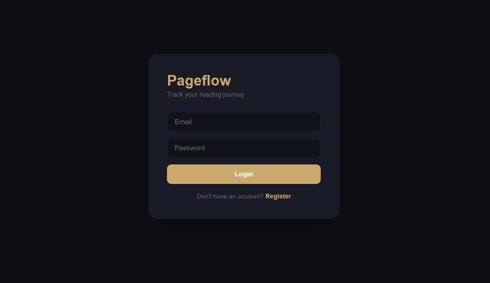
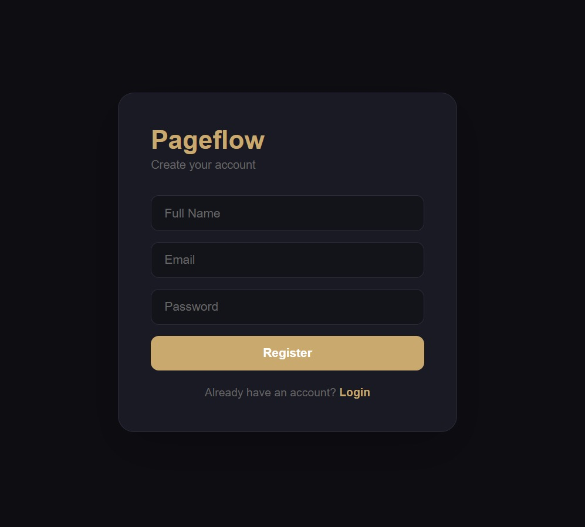
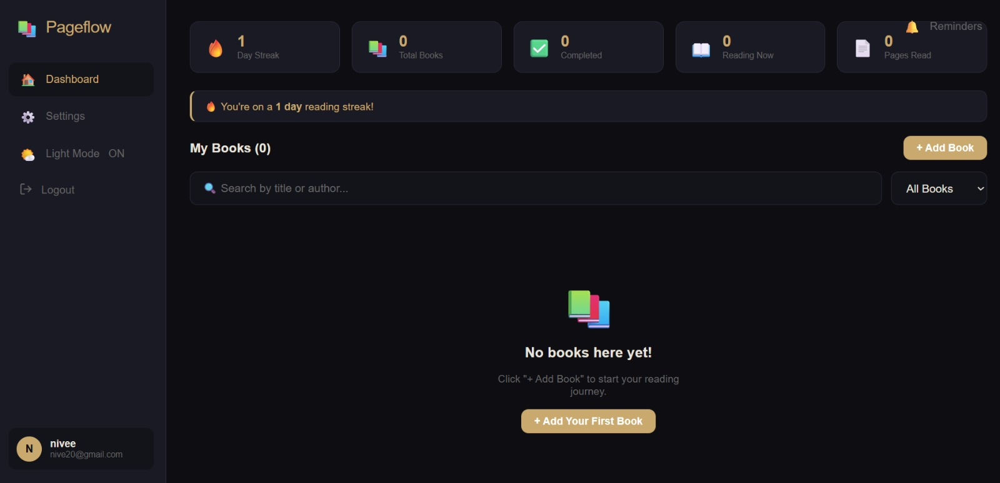
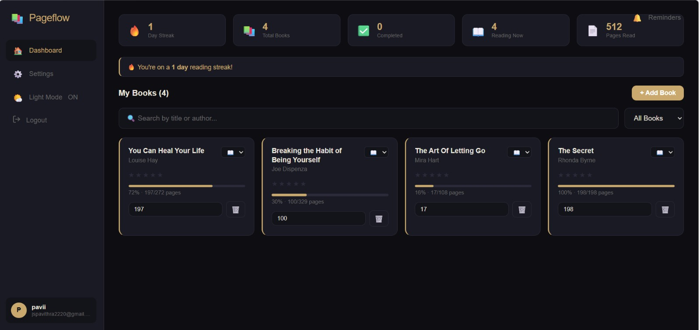
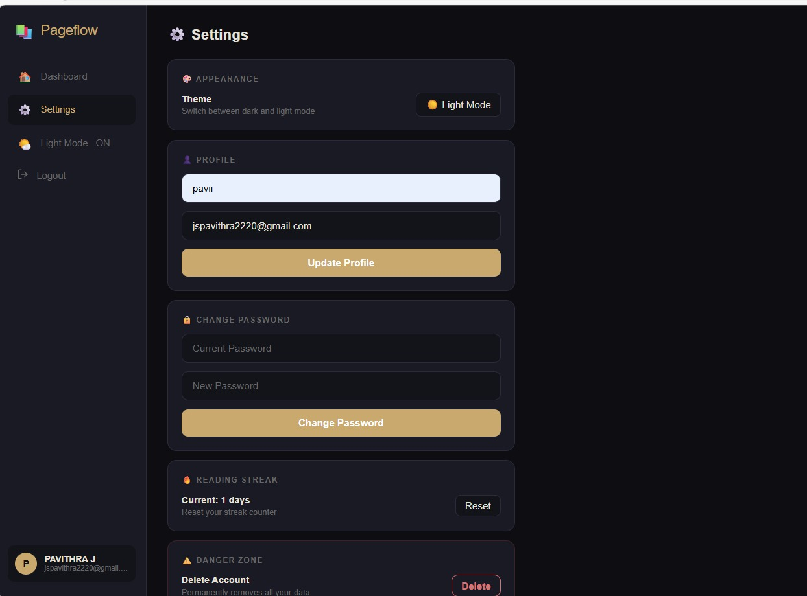

# Book-Reader-Tracker20
# 📚 Book Reader Tracker

A full stack web application built to track reading habits, manage books, and encourage consistent learning through daily reading.

---

## 🌟 Inspiration
As someone who enjoys reading books, I often found it difficult to keep track of what I’ve read and what I’m currently reading.  
This project was created to solve that problem by building a simple and effective book tracking system.

---

## 📌 About the Project
Book Reader Tracker helps users organize their reading journey by allowing them to add books, monitor progress, and manage reading status in one place.

---

## ✨ Features
- ➕ Add new books with details  
- 📖 Track reading progress  
- 📂 Categorize books (To Read / Reading / Completed)  
- 📝 Update and manage book details  
- 🗑️ Remove books from the list  

---

## 🛠️ Tech Stack
- Frontend: React.js, HTML, CSS, JavaScript  
- Backend: Node.js, Express.js  
- Database: MongoDB / MySQL  

---
## 📸 Screenshots

### 🔐 Login Page

### 📝 Register Page

### 📊 Dashboard / Home

### 📚 Books Page

### ⚙️ Settings Page

